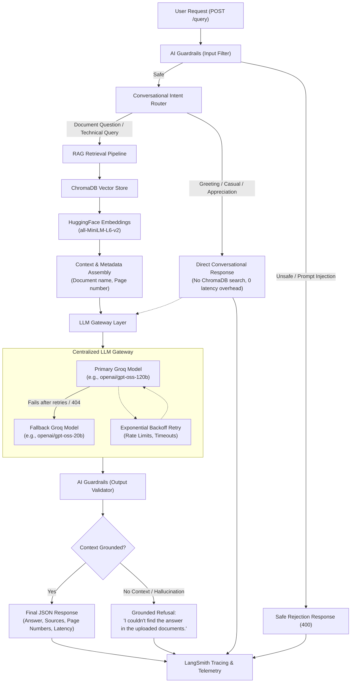

# 🚀 Embedded Systems QA Assistant (Production RAG Architecture)

A production-grade, observable, and resilient Retrieval-Augmented Generation (RAG) backend engineered for technical document Question-Answering in Embedded Systems.

Upgraded from Streamlit to a modular **FastAPI** service with a **Centralized LLM Gateway**, **Conversational Intent Router**, **AI Guardrails**, **LangSmith Observability**, and **Ragas Evaluation**.

---

## 🏗️ System Architecture



---

## 🌟 Key Features

1. **Centralized LLM Gateway (`app/gateway/`)**:
   - Single point of entry for all LLM calls.
   - Automatic retries with exponential backoff on transient errors (rate-limits, network, timeouts).
   - Zero-downtime fallback to secondary model when primary fails or is decommissioned.
   - Configurable models via `.env` (`PRIMARY_MODEL`, `FALLBACK_MODEL`).
   - Latency tracking and token usage accounting.

2. **Conversational Intent Router (`app/router/`)**:
   - Executes **BEFORE** vector search and ChromaDB retrieval.
   - Detects greetings ("hello", "hi"), casual conversation ("how are you"), appreciation ("thank you"), and farewells ("bye").
   - Responds instantly with friendly natural messages **without requiring uploaded documents or performing expensive vector searches**.
   - Defaults ambiguous and technical queries to RAG to guarantee accuracy.

3. **Two-Way AI Guardrails (`app/guardrails/`)**:
   - **Input Guardrails**: Detects and neutralizes prompt injections, system prompt leak attempts, jailbreaks ("DAN mode"), and malicious shell commands.
   - **Output Guardrails**: Validates that answers are grounded in retrieved context, enforces standardized refusals when facts are absent, and blocks API keys or internal stack traces from leaking.

4. **Production FastAPI Service (`app/api/`)**:
   - Full REST API replacing Streamlit.
   - Automatic Swagger documentation at `/docs` and ReDoc at `/redoc`.
   - Strict Pydantic v2 schemas and validation for requests and responses.
   - Structured JSON logging with automatic API key redaction.

5. **Complete Document Pipeline (`app/rag/`)**:
   - Native support for **PDF**, **DOCX**, **TXT**, and **CSV**.
   - MD5 chunk-level deduplication to prevent duplicate embeddings.
   - Page-level reference tracking preserved from document ingestion to final output.

6. **Full-Pipeline Observability (`LangSmith`)**:
   - Traces every pipeline phase: document processing → chunking → embeddings → retrieval → LLM generation → guardrails.
   - Records metadata: query, intent, model used, fallback status, retrieved sources, execution time.

7. **Independent Ragas Evaluation (`app/evaluation/`)**:
   - Evaluates: **Faithfulness**, **Answer Relevancy**, **Context Precision**, and **Context Recall**.
   - Completely separated from the API to guarantee zero runtime latency penalty on user queries.

---

## 📁 Project Directory Structure

```text
Embedded Systems QA Assistant/
├── .env.example              # Environment configuration template
├── Dockerfile                # Production Docker container definition
├── requirements.txt          # Production dependencies
├── README.md                 # System documentation
└── RAG/
    ├── app/                  # Modular Application Package
    │   ├── api/              # FastAPI routers & endpoints (/query, /documents, /health)
    │   ├── core/             # Configuration, structured logging, custom exceptions
    │   ├── evaluation/       # Ragas evaluation runner and metrics
    │   ├── gateway/          # Centralized LLM Gateway (retries + fallback)
    │   ├── guardrails/       # Input (injection) & Output (grounding) guardrails
    │   ├── models/           # Pydantic schemas for requests and responses
    │   ├── rag/              # Loaders, splitters, vector store, retriever, pipeline
    │   ├── router/           # Conversational intent classifier (runs pre-retrieval)
    │   ├── services/         # Document and RAG business logic
    │   ├── utils/            # Hash computation & file helpers
    │   └── main.py           # FastAPI application entry point
    ├── chroma_db/            # Persisted Chroma vector database
    ├── uploaded_documents/   # Uploaded document repository
    ├── evaluation/           # Evaluation datasets and evaluation scripts
    │   ├── test_dataset.csv  # Benchmark test questions and reference answers
    │   └── evaluate_rag.py   # Standalone CLI evaluation script
    └── test_rag_system.py    # Automated test suite
```

---

## ⚙️ Environment Variables

Create a `.env` file in the project directory using `.env.example`:

| Variable | Description | Default | Required |
|---|---|---|---|
| `GROQ_API_KEY` | Groq API Key for LLM inference | None | **Yes** |
| `PRIMARY_MODEL` | Primary LLM model used by gateway | `openai/gpt-oss-120b` | No |
| `FALLBACK_MODEL` | Secondary fallback model if primary fails | `openai/gpt-oss-20b` | No |
| `LANGSMITH_API_KEY` | LangSmith API key for tracing | None | No |
| `LANGSMITH_PROJECT` | LangSmith project name | `embedded-systems-qa` | No |
| `LANGSMITH_TRACING` | Toggle LangSmith distributed tracing | `false` | No |
| `EMBEDDING_MODEL` | HuggingFace embedding model | `sentence-transformers/all-MiniLM-L6-v2` | No |
| `CHROMA_DIRECTORY` | ChromaDB persistence directory | `./chroma_db` | No |
| `COLLECTION_NAME` | ChromaDB collection name | `academic_qa` | No |
| `PORT` | API server port | `8000` | No |

---

## 🛠️ How to Run Locally

### 1. Prerequisites
- Python 3.11+
- Virtual environment (`venv` or `uv`)

### 2. Setup Virtual Environment
```bash
# Using Python venv
python -m venv .venv

# Activate on Windows PowerShell:
.\.venv\Scripts\Activate.ps1

# Activate on Linux/macOS:
source .venv/bin/activate
```

### 3. Install Dependencies
```bash
pip install -r requirements.txt
```

### 4. Configure Environment
```bash
cp .env.example .env
# Edit .env and paste your GROQ_API_KEY
```

### 5. Start the FastAPI Server
```bash
cd RAG
python -m uvicorn app.main:app --host 0.0.0.0 --port 8000 --reload
```
The interactive API documentation will be available at:
👉 **Swagger UI**: `http://localhost:8000/docs`  
👉 **ReDoc**: `http://localhost:8000/redoc`

---

## 📡 API Endpoints

### 1. `POST /query`
Submit a question to the assistant.
- **Request Body**:
  ```json
  {
    "query": "What is polymorphism?",
    "top_k": 5
  }
  ```
- **Response**:
  ```json
  {
    "query": "What is polymorphism?",
    "intent": "rag_query",
    "answer": "Polymorphism means 'one thing behaving in many ways'...",
    "retrieved_sources": [
      {
        "document_name": "Object Oriented Programming.pdf",
        "page_number": 4,
        "relevance_score": 0.715,
        "snippet": "4. Polymorphism: Easy Explanation..."
      }
    ],
    "model_used": "openai/gpt-oss-120b",
    "is_fallback": false,
    "confidence": "grounded",
    "execution_time_ms": 1420.5
  }
  ```

### 2. `POST /documents/upload`
Uploads a PDF, DOCX, TXT, or CSV file.
- **Form Data**: `file` (Multipart file)
- **Response**:
  ```json
  {
    "filename": "embedded_manual.pdf",
    "document_id": "9bf528f534efcbd2a7487a86ab5759a6",
    "file_size_bytes": 1285088,
    "status": "uploaded",
    "message": "File 'embedded_manual.pdf' uploaded successfully."
  }
  ```

### 3. `POST /documents/process`
Parses and indexes uploaded documents into ChromaDB.
- **Query Params**: `filename` (optional: specify filename or omit to process all unindexed documents)
- **Response**:
  ```json
  {
    "processed_documents": ["embedded_manual.pdf"],
    "total_chunks_added": 19,
    "total_documents_in_index": 2,
    "status": "success",
    "message": "Processed 1 document(s) with 19 total chunks added."
  }
  ```

### 4. `GET /documents`
Lists all documents and chunk counts currently indexed.

### 5. `GET /health`
Returns system health, ChromaDB connection, and model statuses.

---

## 🧪 How to Test the RAG API

Run the comprehensive automated test suite covering all 11 requirements:
```bash
cd RAG
python test_rag_system.py
```
This tests:
1. Health check & Chroma connectivity
2. Document inventory
3. Greeting conversational routing (zero retrieval cost)
4. Casual conversation routing
5. Appreciation routing
6. Prompt injection guardrail blocking
7. Malicious instruction guardrail blocking
8. Grounded RAG document query with source tracking
9. Unanswerable question grounding check
10. Automatic LLM Gateway fallback activation

---

## 📊 How to Run Ragas Evaluation

The evaluation suite runs independently to measure RAG quality without affecting API traffic.

```bash
cd RAG
python evaluation/evaluate_rag.py
```
**Metrics Evaluated**:
- **Faithfulness**: Measures if the answer is grounded solely in the retrieved context.
- **Answer Relevancy**: Measures how directly the answer addresses the question.
- **Context Precision**: Evaluates the signal-to-noise ratio in retrieved chunks.
- **Context Recall**: Compares retrieved context against reference ground truth answers.

Outputs generated:
- `evaluation/ragas_results.csv`: Per-question score breakdown.
- `evaluation/ragas_summary.csv`: Macro-average scores across all metrics.

---

## 🔍 How to Verify LangSmith Tracing

1. In `.env`, set:
   ```ini
   LANGSMITH_API_KEY=your_langsmith_api_key
   LANGSMITH_PROJECT=embedded-systems-qa
   LANGSMITH_TRACING=true
   ```
2. Start the server and send queries via `/query`.
3. Open [smith.langchain.com](https://smith.langchain.com) and navigate to the `embedded-systems-qa` project.
4. You will see detailed distributed traces for every query:
   - `rag_service_query`: Records `intent = greeting`, `intent = rag_query`, or `intent = unsafe`.
   - `rag_retrieval`: Displays retrieved chunks, similarity scores, and documents.
   - `llm_gateway_generate`: Displays latency, prompt tokens, completion tokens, model name, and fallback status.

---

## 🔄 How the LLM Fallback Works

The LLM Gateway is designed with resilience for production reliability:
1. **Primary Invocation**: Requests are sent to `PRIMARY_MODEL` (e.g. `openai/gpt-oss-120b`).
2. **Transient Error Retry**: If Groq returns rate-limit (429), connection error, or timeout, the gateway retries up to 3 times with exponential backoff (`backoff_factor = 1.5`).
3. **Automatic Fallback**: If the primary model fails all retries, or raises a non-retryable error (such as a 404 model unavailable/decommissioned), the gateway logs a warning and automatically dispatches the identical prompt to `FALLBACK_MODEL` (e.g. `openai/gpt-oss-20b`).
4. **Metadata Tracking**: The returned response contains `is_fallback: true` and `model_used: "openai/gpt-oss-20b"`, allowing monitoring systems to alert on fallback frequency.

---

## 🐳 Docker Deployment

Build and run using Docker:
```bash
# Build Docker image
docker build -t embedded-qa-assistant:latest .

# Run container
docker run -d -p 8000:8000 --env-file .env --name embedded-qa embedded-qa-assistant:latest
```
Check health:
```bash
curl http://localhost:8000/health
```
